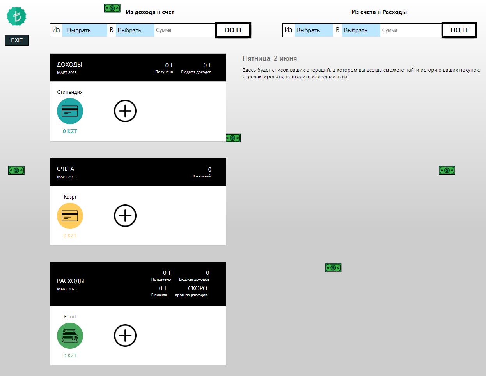

### Introduction
- The project is made as a copy of the main coinkeeper 
- For login use login:ad1lek   password: 123123(Or you can signup).
- npm install, npm start - for working with react.

### 🔥 Used:

  &nbsp
  &nbsp
  &nbsp
  &nbsp
  &nbsp
  &nbsp

- Website adapted for mobile version.

- Semantic layout.
- Miscellaneous working with functions and using React Hooks

### 📝 Screenshots
### Login Page
Used localStorage.
 

 

### Main Page 

 

